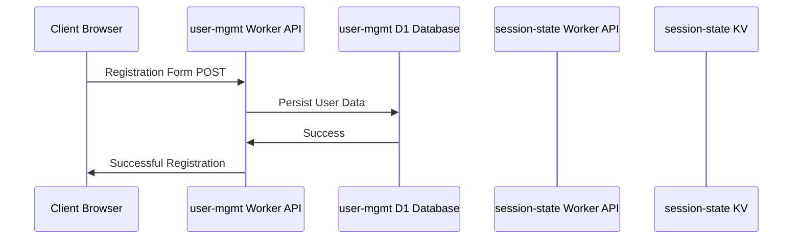
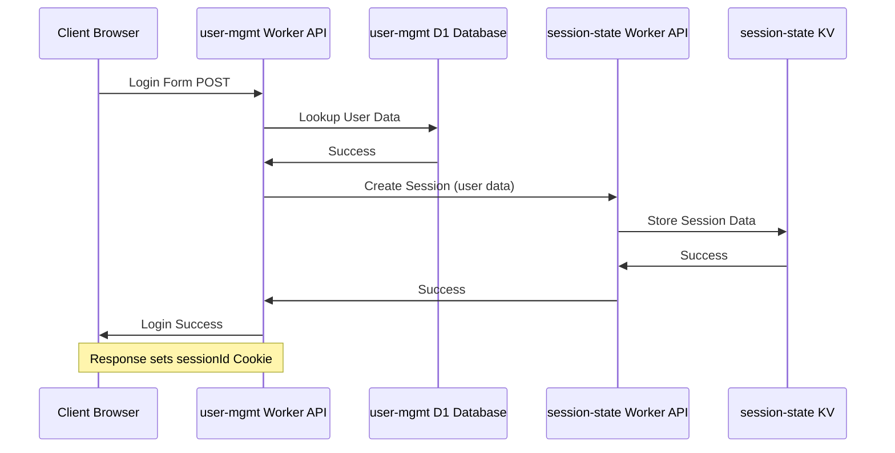
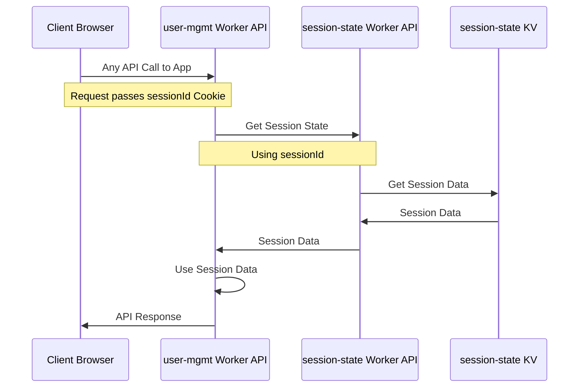

# Diagrams

## Sequence Diagrams
These diagrams are simplified and assume that relevant validation is done, errors are handled, etc...

### Registration Sequence Diagram

### Login Sequence Diagram

### Logged In Get Session State Sequence Diagram

